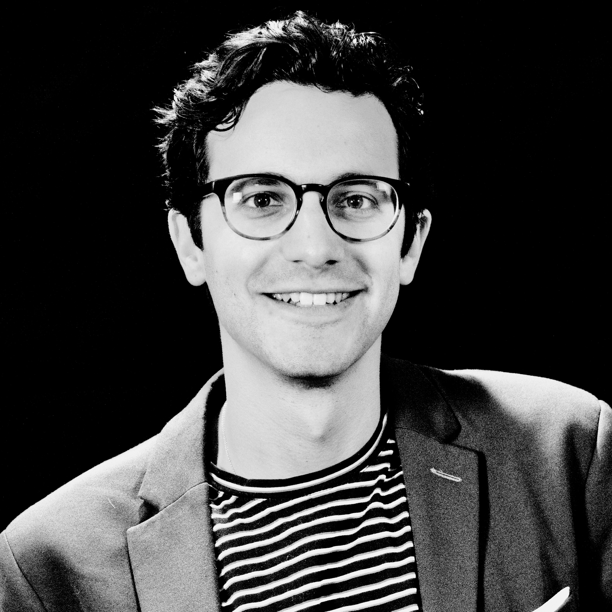

I am currently a Member of Technical Staff at [Flourish Labs](https://flourishlabs.ai/) based in NYC 🥯🗽.  

Most recently, I was a Research Scientist at [Databricks Research](https://www.databricks.com/blog/category/databricks-ai?categories=databricks-ai%2Cai-research%2Cai-engineering). I did my PhD in the [Center for Theoretical Neuroscience](https://ctn.zuckermaninstitute.columbia.edu/) at Columbia University. After my PhD, I was a Research Scientist at [MosaicML](https://github.com/mosaicml), which got acquired by Databricks in July 2023.

I look forward to the day when we start using everything we've learned about LLMs to understand the human brain. For now though, I think there is a lot of exciting research at the forefront of LLM pretraining and post training.

Feel free to reach out at jacob [arroba] flourishlabs.ai

  <a class="profile-link" href="https://www.linkedin.com/in/jacob-portes-82804062" target="_blank" rel="noopener noreferrer">LinkedIn</a>
  <a class="profile-link" href="https://scholar.google.com/citations?hl=en&user=CzH4cSEAAAAJ" target="_blank" rel="noopener noreferrer">Google Scholar</a>
  <a class="profile-link" href="https://github.com/jacobfulano" target="_blank" rel="noopener noreferrer">GitHub</a>
  <a class="profile-link" href="https://twitter.com/JacobianNeuro" target="_blank" rel="noopener noreferrer">Twitter</a>

